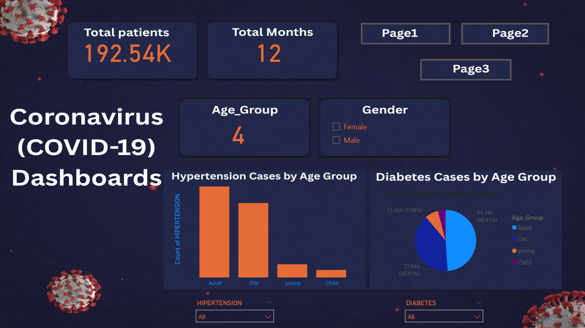
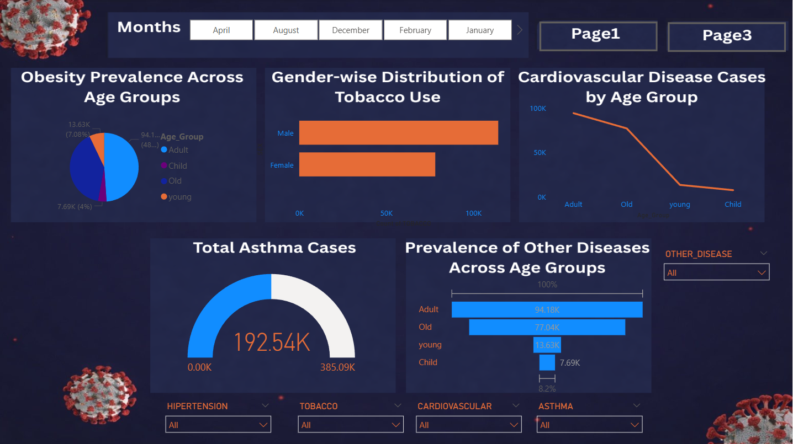

🦠 Coronavirus (COVID-19) Health Analytics Dashboard

📌 Project Overview

The COVID-19 Health Analytics Dashboard is a data visualization project designed to analyze patient statistics, health conditions, and COVID-19 outcomes across different age groups, genders, and time periods.
This dashboard provides meaningful insights into how COVID-19 impacts populations with pre-existing health conditions and how outcomes vary across demographics.

🎯 Objectives

Analyze total COVID-19 patient data

Study the impact of age and gender on health conditions

Track comorbidities such as hypertension, diabetes, asthma, obesity, and cardiovascular disease

Analyze final COVID-19 outcomes (Alive vs Dead)

Understand month-wise and age-wise trends

🏠 Dashboard Overview (Page 1)

Total Patients

Total Months

Age Group count

Gender selection (Male / Female)

Key health condition analysis:

Hypertension cases by age group

Diabetes cases by age group

Interactive filters for:

Hypertension

Diabetes

🩺 Health Condition Analysis (Page 2)

Obesity prevalence across age groups

Gender-wise distribution of tobacco use

Cardiovascular disease cases by age group

Total asthma cases (gauge visualization)

Prevalence of other diseases across age groups

Interactive slicers for:

Hypertension

Tobacco

Cardiovascular

Asthma

Other diseases

Month selection

📊 COVID-19 Outcome Analysis (Page 3)

Final COVID-19 outcomes by age group

Comparison of:

Recovered (Alive)

Deaths (Dead)

Outcome analysis based on:

Age group

Final test result (Positive / Negative)

Month-wise filtering for trend analysis

🔍 Key Insights

Adults and elderly populations show higher case counts

Comorbidities significantly increase health risks

Mortality is higher among older age groups

Chronic diseases play a major role in COVID-19 severity

Gender and lifestyle factors (e.g., tobacco use) influence outcomes

🔧 Key Features

Multi-page interactive dashboard

Age group, gender, and month slicers

Combination of:

Bar charts

Pie charts

Line charts

Gauge visuals

Clean dark-theme medical dashboard design

Easy navigation between pages

🛠️ Tools & Technologies

Power BI – Dashboard creation & visualization

Data Analysis – Data cleaning, aggregation, KPI calculation

Healthcare / COVID-19 Dataset (CSV / Excel) – Data source

📷 Dashboard Screenshots

(Add image file names exactly as they exist in your repository)

 Health Analytics Dashboard
📌 Project Overview

The COVID-19 Health Analytics Dashboard is a data visualization project designed to analyze patient statistics, health conditions, and COVID-19 outcomes across different age groups, genders, and time periods.
This dashboard provides meaningful insights into how COVID-19 impacts populations with pre-existing health conditions and how outcomes vary across demographics.

🎯 Objectives

Analyze total COVID-19 patient data

Study the impact of age and gender on health conditions

Track comorbidities such as hypertension, diabetes, asthma, obesity, and cardiovascular disease

Analyze final COVID-19 outcomes (Alive vs Dead)

Understand month-wise and age-wise trends

🏠 Dashboard Overview (Page 1)

Total Patients

Total Months

Age Group count

Gender selection (Male / Female)

Key health condition analysis:

Hypertension cases by age group

Diabetes cases by age group

Interactive filters for:

Hypertension

Diabetes

🩺 Health Condition Analysis (Page 2)

Obesity prevalence across age groups

Gender-wise distribution of tobacco use

Cardiovascular disease cases by age group

Total asthma cases (gauge visualization)

Prevalence of other diseases across age groups

Interactive slicers for:

Hypertension

Tobacco

Cardiovascular

Asthma

Other diseases

Month selection

📊 COVID-19 Outcome Analysis (Page 3)

Final COVID-19 outcomes by age group

Comparison of:

Recovered (Alive)

Deaths (Dead)

Outcome analysis based on:

Age group

Final test result (Positive / Negative)

Month-wise filtering for trend analysis

🔍 Key Insights

Adults and elderly populations show higher case counts

Comorbidities significantly increase health risks

Mortality is higher among older age groups

Chronic diseases play a major role in COVID-19 severity

Gender and lifestyle factors (e.g., tobacco use) influence outcomes

🔧 Key Features

Multi-page interactive dashboard

Age group, gender, and month slicers

Combination of:

Bar charts

Pie charts

Line charts

Gauge visuals

Clean dark-theme medical dashboard design

Easy navigation between pages

🛠️ Tools & Technologies

Power BI – Dashboard creation & visualization

Data Analysis – Data cleaning, aggregation, KPI calculation

Healthcare / COVID-19 Dataset (CSV / Excel) – Data source

📷 Dashboard Screenshots

(Add image file names exactly as they exist in your repository)

🚀 Conclusion

This project demonstrates strong skills in healthcare data analysis, dashboard storytelling, and data-driven insights.
It is highly suitable for Data Analyst portfolios, especially in health analytics and public health reporting.age2.png)

